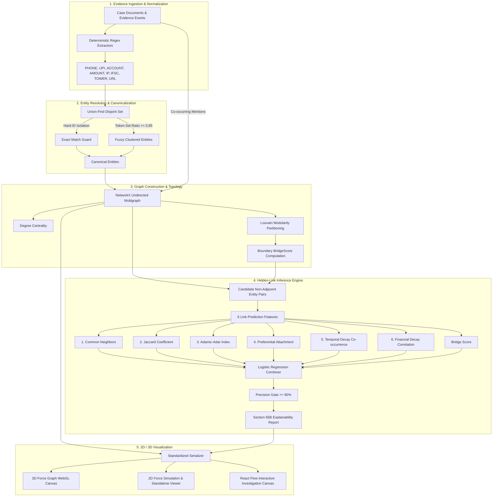

# CyberDrishti AI — Graph Engine: Architecture & Technical Deep-Dive

This document details the exact mathematics, algorithmic workflows, machine-learning formulations, and frontend rendering systems powering the **CyberDrishti AI Graph Engine**.

---

## 1. High-Level Architecture

The Graph Engine transforms disparate, unstructured, multi-source evidence (WhatsApp exports, bank statements, CDR logs, IP login tables, and payment screenshots) into a **court-admissible investigative knowledge graph** with **precision-gated hidden link inference**.



---

## 2. Phase-by-Phase Technical Breakdown

### Phase 1: Deterministic Entity Extraction
Cyber crime investigations in India require exact entity identification. In [`extractors.py`](./core/extractors.py), deterministic regular expressions serve as the **source of truth** for hard identifiers:

- **PHONE**: `(?:\+91[\s\-]?)?[6-9]\d{9}\b` &rarr; Normalized to canonical format `+91XXXXXXXXXX`.
- **UPI**: `[\w.\-]{2,256}@[a-zA-Z]{2,64}\b` &rarr; Normalized to lowercase VPA handle.
- **ACCOUNT**: `\b\d{9,18}\b` &rarr; Guarded against phone number overlap.
- **AMOUNT**: Suffix-aware regex parsing (`₹`, `Rs.`, `lakh`, `crore`, `k`) converted to float INR.
- **IFSC**: `\b[A-Z]{4}0[A-Z0-9]{6}\b` (4-character bank code + `0` + 6-digit branch code).
- **IP**: `\b(?:\d{1,3}\.){3}\d{1,3}\b` (IPv4 network addresses).

---

### Phase 2: Union-Find Entity Resolution & Canonicalization

In [`canonicalizer.py`](./core/canonicalizer.py), entity mentions are resolved using a **Disjoint-Set (Union-Find)** data structure with path compression and union-by-rank:

$$\text{Find with Path Compression: } \alpha(n) \le 4 \text{ for any practical input } n$$

#### Strict Guard Rules:
1. **Hard-Identifier Isolation**: Entities of type `PHONE`, `UPI`, `ACCOUNT`, `EMAIL`, `IFSC`, `IP`, `IMEI`, `AADHAAR`, `PAN`, or `VEHICLE` **NEVER** undergo fuzzy matching:
   $$\text{similarity}(a, b) = \begin{cases} 1.0 & \text{if } a_{\text{norm}} = b_{\text{norm}} \\ 0.0 & \text{otherwise} \end{cases}$$
2. **Fuzzy Name Matching**: Non-hard entities (e.g. `PER`, `ORG`, `LOCATION`) use fuzzy token-set similarity:
   $$\text{sim}(a, b) = \frac{\text{TokenSetRatio}(a, b)}{100.0} \ge 0.85$$
3. **Transitive Merging**: If $A \sim B$ and $B \sim C$, Union-Find merges $\{A, B, C\}$.
4. **Canonical Representative Selection**: The canonical label is the most frequently observed raw string within the cluster.

---

### Phase 3: Graph Construction & Topological Metrics

In [`builder.py`](./core/builder.py), a NetworkX undirected graph $G = (V, E)$ is built from entities and evidence events:

#### Node Attributes:
- $V = \{u \mid u \text{ is a canonical entity}\}$
- `entity_type`: `PER`, `PHONE`, `UPI`, `ACCOUNT`, `AMOUNT`, `IP`, etc.
- `degree_centrality`:
  $$C_D(u) = \frac{\deg(u)}{|V| - 1}$$
- `community_id`: Integer community cluster index assigned by **Louvain Modularity Optimization**:
  $$Q = \frac{1}{2m} \sum_{i,j} \left[ A_{ij} - \frac{k_i k_j}{2m} \right] \delta(c_i, c_j)$$
- `bridge_score`: Fraction of a node's edges that cross community boundaries:
  $$\text{BridgeScore}(u) = \frac{|\{v \in N(u) \mid \text{comm}(v) \ne \text{comm}(u)\}|}{|N(u)|}$$

#### Edge Attributes:
- Observed edge $e = (u, v)$ is created whenever entities $u$ and $v$ co-occur within the same evidence event (e.g., chat message, CDR call log, IMPS bank transaction).
- `weight`: Number of distinct events witnessing co-occurrence.
- `timestamps`: Chronological list of event observation timestamps.

---

### Phase 4: 6-Feature Hidden-Link Inference Engine

In [`hidden_link_engine.py`](./core/hidden_link_engine.py), all **non-adjacent** entity pairs $(u, v) \notin E$ are evaluated across 6 topological and domain features:

| # | Feature | Mathematical Formulation | Investigative Rationale |
|---|---|---|---|
| 1 | **Common Neighbors** | $|\mathcal{N}(u) \cap \mathcal{N}(v)|$ | Shared intermediaries (mule accounts, middle-men phones). |
| 2 | **Jaccard Coefficient** | $\frac{\|\mathcal{N}(u) \cap \mathcal{N}(v)\|}{\|\mathcal{N}(u) \cup \mathcal{N}(v)\|}$ | Overlap relative to total entity connections. |
| 3 | **Adamic-Adar Index** | $\sum_{w \in \mathcal{N}(u) \cap \mathcal{N}(v)} \frac{1}{\log \deg(w)}$ | Shared connections with low degree indicate tight conspiracy. |
| 4 | **Preferential Attachment** | $\deg(u) \times \deg(v)$ | High-degree hubs (central syndicate nodes) naturally link. |
| 5 | **Temporal Co-occurrence** | $\sum_{t_u, t_v} \exp\left(-\frac{\|t_u - t_v\|}{\tau_{\text{temporal}}}\right)$ ($\tau = 3600s$) | Actions occurring within tight timeframes (e.g., call followed by cash transfer). |
| 6 | **Financial Correlation** | $\left(1 - \frac{\|a_u - a_v\|}{\max(a_u, a_v)}\right) \times \exp\left(-\frac{\|t_u - t_v\|}{\tau_{\text{fin}}}\right)$ | Money trail match (sent amount matches received amount within time decay $\tau_{\text{fin}} = 7200s$). |
| 7 | **Bridge Score** | $\frac{\text{BridgeScore}(u) + \text{BridgeScore}(v)}{2}$ | Likelihood of bridging distinct conspiracy clusters. |

#### Machine Learning Combiner & Precision-Gated Thresholding:
The 7-dimensional feature vector $\mathbf{x} = [x_1, \dots, x_7]^T$ is standardized via $\text{StandardScaler}$ and scored using regularized **Logistic Regression**:

$$P(\text{hidden\_link} \mid \mathbf{x}) = \sigma(\mathbf{w}^T \tilde{\mathbf{x}} + b) = \frac{1}{1 + e^{-(\mathbf{w}^T \tilde{\mathbf{x}} + b)}}$$

#### Why Precision Gating ($\ge 90\%$) is Mandatory:
In criminal law, false accusations can lead to unlawful arrest or wrongful conviction. To uphold the standard of reasonable doubt:
- The decision threshold $\theta$ is selected via **Stratified Group K-Fold Cross Validation** such that:
  $$\text{Precision}(\theta) = \frac{\text{True Positives}}{\text{True Positives} + \text{False Positives}} \ge 0.90$$
- Any inferred link whose score $P \ge \theta$ is flagged with a **Section 65B Court-Admissible Explainability Report**.

---

### Phase 5: Explainability Report (Section 65B Indian Evidence Act)

Every inferred link produces an `ExplainabilityReport`:
```python
ExplainabilityReport(
    flag_id="Vikram Sharma__382910475819",
    entities=["Vikram Sharma", "382910475819"],
    component_scores={
        "common_neighbors": 1.0,
        "jaccard": 0.50,
        "adamic_adar": 1.44,
        "temporal": 1.25,
        "financial": 0.94,
        "bridge_score": 0.25,
        "preferential_attachment": 6.0
    },
    model_weights={"cn": 0.052, "jaccard": -0.181, ...},
    final_score=0.784,
    threshold=0.365,
    decision="flagged",
    source_citations=[...]
)
```

---

## 3. Frontend Architecture (Graph Only)

The graph engine includes both:
1. **Interactive Standalone Viewer (`frontend/standalone_viewer/`)**:
   - Zero external web server or Node.js runtime needed.
   - 2D Canvas Force-Directed simulation using Barnes-Hut physics.
   - Interactive threshold slider, 2-hop neighborhood isolation, entity filter chips.
   - Forensic Inspector sidebar with metric meters and component score bars.
2. **React / Next.js Production Components (`frontend/react_components/`)**:
   - `GraphPage.tsx`: Complete case graph screen with layout switcher (Force, Radial, Hierarchical, Clustered).
   - `Graph3DCanvas.tsx`: Three.js / WebGL 3D Force Graph canvas with particle streams, glowing node spheres, bloom post-processing, and pulsing amber dashed hidden links.
   - `threatGraphService.ts`: TypeScript service interfaces and API definitions.

---

## 4. Quick Verification Commands

```bash
# 1. Run unit tests
python3 -m unittest tests/test_graph_engine.py

# 2. Train or update the ML model
python3 trainer.py --cases 40

# 3. Run the end-to-end demo
python3 demo.py

# 4. Open the standalone graph in your browser
open sample_data/sample_graph_visualization.html
# or
open frontend/standalone_viewer/index.html
```
